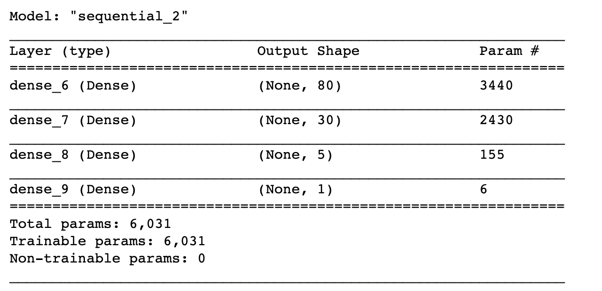
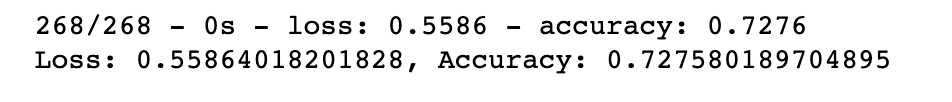

# Neural_Network_Charity_Analysis

## Purpose
The purpose of this analysis was to develop a machine learning model using neural networks to predict whether or not charity applicants will be successful if funded by Alphabet Soup. 

## Results 
### Data Preprocessing
1. Target variable: IS_SUCCESSFUL
2. Features variables: APPLICATION_TYPE, AFFILIATION, CLASSIFICATION, USE_CASE, ORGANIZATION, INCOME_AMT, SPECIAL_CONSIDERATIONS, STATUS
3. Removed variables: EIN and NAME were removed because these are identification columns that don't add value to the model. ASK_AMT was removed becuase there's a big difference in integer value compared to the rest of the columns that can cause confusion in the model. Addidionally, the ammount of funding charities ask for is unlikely to determine if the charity applicatnts will be successful. If it did, all applicants will eventually ask for the same ammount of funding to have the best chances of getting funded.    

### Compiling, Training, and Evaluating the Model
#### Steps taken to increase model performance: 
1. Original model: 72.41% 
2. Test #1: performance of 72.72% reached by dropping ASK_AMT from features variables. 
3. Test #2: performance of 72.57% reached by increasing neurons to 120 and 40 to first and second hidden layers, respectively. 
4. Test #3: performance of 72.76% reached by reverting back to number of neurons in test #1 and adding a third hidden layer. 
5. Test #4: performance of 72.44% reached by changing activation for hidden layers from rely to sigmoid.  
    
#### Best performing model: Test #3
1. Hidden layer quantity: 3. Reason being that out of two optimization tests (2 vs 3), the best performing test had 3 hidden layers. 
2. Neuron quantity for first hidden layer: 80. It is common practice to make the number of neurons in the first hidden layer 2x or 3x as large as the number of inputs, in this case 42. It is important not to go above 3x to prevent overfitting. Two optimization tests were conducted to measure the number of neurons (2x vs 3x) that result in the highest model accuracy level, and the winner was 2x. Therefore the quantity of 80 for the first hidden layer. 
3. Neuron quantity for second hidden layer: 30 -- Reason being that out of two optimization tests (30 vs 40), the best performing test had 30 neurons for the second hidden layer.  
4. Neuron quantity for third hidden layer: 5. The tests conducted with 3 hidden layers had 5 neurons for the third hidden layer, and one of these tests was the best performing test. 
5. Activation function for hidden layers: relu. Reason being that relu performed better than sigmoid during optimization testing. 
6. Activation function for output layer: sigmoid. Reason being that this activation function was never altered during optimization testing. 

7. The model is 73% accurate. The target model performance of 75% was not achieved. 

## Summary 
A neural network machine learning model with 73% accuracy was developed to predict whether or not charity applicants will be successful if funded by Alphabet Soup. To further improve model performance, a Support Vector Machine (SVM) model could be used in place of this neural network model. Since this is a binary classification problem, SVM has an advantage over the neural network model used. Naural network's disadvatage lies in its convergance on a local minima which could often focus on a specific trend and miss the binary cutoff needed. On the other hand, SVM focuses on maximizing the distance between the closest data point of two groups. 

 
